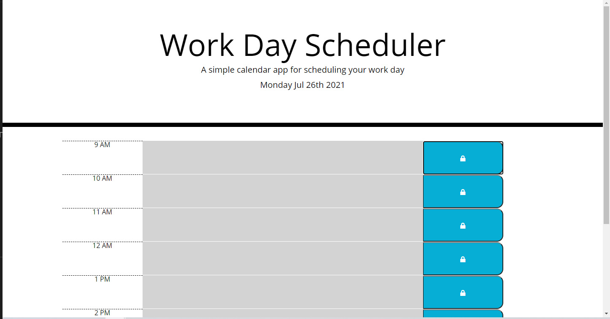

# Work Day Scheduler

An hourly planner for the current day that starts at 9AM and goes to 5PM.

The program implements a combination of HTML, CSS, JS, jQuery, Moment, and Bootstrap to store the schedule on localStorage.

[Click here to plan your day.](https://mattersievers.github.io/Work-Day-Scheduler/)

